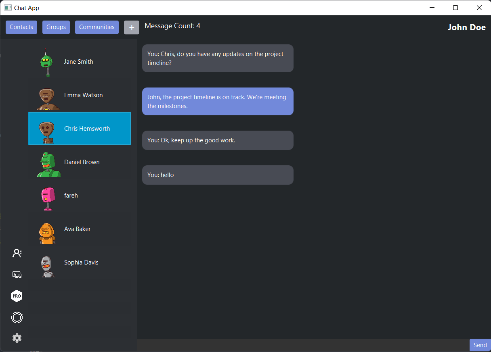
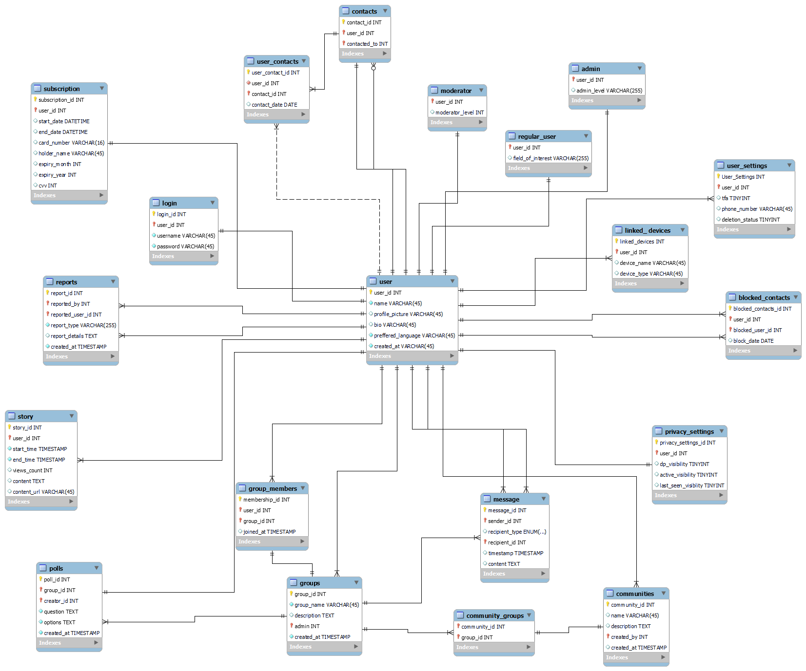

# Chat App

Chat App is a JavaFX application that allows users to communicate through individual chats and group chats. It provides a user-friendly interface for sending and receiving messages in real-time.(not real-time yet).

The EERD for the database(not final, might contain errors) is as follows:

## Features

- **Contacts**: Users can view and select their contacts from a list to initiate individual chats.
- **Groups**: Users can create groups and invite other users to join. Group members can exchange messages within the group.
- **Message Editing**: Users can edit their own messages in both individual chats and group chats.
- **Message Deletion**: Users can delete their own messages in both individual chats and group chats.
- **Dark Theme**: The application provides a visually appealing dark theme for better readability and user 
experience.
- **User Authentication**: Users can create new accounts and log in to the application using their credentials.
- **User Status**: Users can view the status of their contacts and groups to know if they are online or offline.
- **User Profile**: Users can view and update their profile information such as name, email, and profile picture.
- **Profile Pictures**: Users can upload and update their profile pictures.
- **Privacy Settings**: Users can control who can view their profile information and profile picture
- **Linked Devices**: Users can view and manage the devices that are linked to their account.
- **Blocked Users**: Users can view and manage the users that are blocked from contacting them.
- **Report**: Users can report other users for inappropriate behavior.
- **Subscriptions**: Users can subscribe to premium plans to unlock additional features.
 

## Requirements

- Java Development Kit (JDK) 8 or later
- JavaFX SDK 8 or later
- MongoDB database

## Installation

1. Clone the repository or download the source code.
2. Open the project in your preferred IDE.
3. JavaFX and mongoDB jre files are included in the project, add them to the reference libraries.
4. Set up the MongoDB database and update the database connection details in the code.
5. Build and run the application.

## Usage

1. Launch the application.
2. Log in with your credentials or create a new account.
3. Select a contact from the contacts list to start an individual chat.
4. Enter your message in the input field and press Enter or click the Send button to send the message.
5. To send a message in a group chat, select the desired group from the groups list.
6. To edit a message, click on the message you want to edit and choose the Edit option from the context menu. Enter the new message content and save the changes.
7. To delete a message, click on the message you want to delete and choose the Delete option from the context menu.

## License

This project is licensed under the [MIT License](LICENSE.md).

## Contributing

Contributions are welcome! Please refer to the [Contribution Guidelines](CONTRIBUTING.md) for more details.

## Authors

- Fareh Iqbal

## Acknowledgments

Special thanks to the contributors and open source projects that provided inspiration and resources for this project.

## Contact

For any inquiries or support, please contact me.